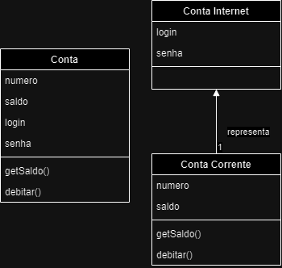
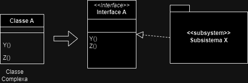
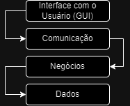
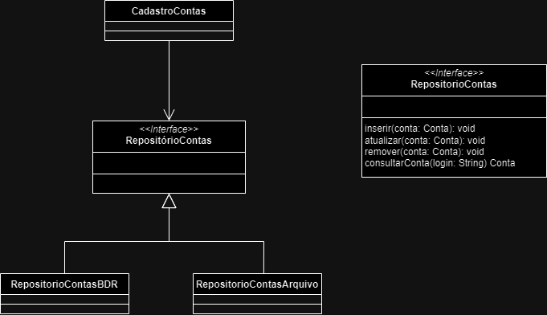

# Projetar Arquitetura - Aula 1
## Relembrando: analisar casos de uso
Passos:
1. Encontrar classes de análise (para **cada caso de uso**);
2. Identificar necessidades de persistência (para **cada caso de uso**);
3. Distribuir Comportamento (para **cada caso de uso**);
4. Descrever responsabilidades (para **cada classe**);
5. Descrever atributos e relacionamentos (para **cada classe**);
6. Revisar os resultados.

Lembrando: **BCE** são estereótipos de análise.

## Projetar Arquitetura
Objetivo
- Avaliar o **conjunto** de classes de análise;
- Definir elementos de **projeto** (classes de projeto e subsistemas);
- Organizar os elementos de projeto em **pacotes**;
- Definir a estrutura da aplicação.

Reuso de Soluções: Padrões
- Padrões de projeto;
- Padrões Arquiteturais.

> Metodologias Ágeis dividem o processo em pequenas partes, priorizando funcionalidades a serem desenvolvidas, e deixando o projeto (macro) de forma mais abstrata, focando a analise apenas no conjunto de funcionalidades de cada _sprint_.

## Passo a Passo
1. Mapear classes de análise em elementos de projeto (elementos = **classes** e **subsistemas**)
    - Identificar classes que representem o mesmo elemento.
    - Documentar relação classe de análise -> classe de projeto
2. Identificar oportunidades de reuso
3. Definir a estrutura da aplicação

### Passo 1: Mapear em Elementos de Projeto
1. Identificar classes de projeto;
2. Identificar subsistemas;
3. Especificar a interface dos subsistemas;
4. Realizar o mapeamento.

Observações:
- 1 classe da análise → 0...n elementos de projeto;
- Mapeamento _m:n_

### Passo 1.1: Identificar classes de projeto
Recomendações Gerais
- Classe de análise **simples** → única classe de projeto
- Classe de análise **muito simples** → podem ser combinadas
- Classes de análise **complexas** → divididas ou virar subsistemas.

### Passo 1.1 Exemplo QIB
Conta
- Responsabilidades distintas: controle de acesso e conta bacária
- Separação favorece reuso.



```java
class ContaInternet {
    private String login;
    private String senha;

    private ContaCorrente credenciais;

    public void m() {
        ContaCorrente conta = new ContaCorrente();
        // 'conta' does something here
    }

}

class ContaCorrente {
    private String numero;
    private double saldo;

}
```
### Passo 1.2: Identificar Subsistemas
Permitem dividir o sistema em partes independentes (componentes).
- Desenvolvido, testado e implantado de forma independente;
- Abstração de produtos ou sistemas externos.

Possíveis fonte (classes de análise):
- Classes de fronteira (interfaces com sistemas externos)
- Classes que fornecem serviços complexos

Possíveis fontes (componentes reutilizáveis):
- Software de comunicação;
- Acesso ao BD;
- Bibliotecas de utilitários;
- Produtos específicos da aplicação.

### Passo 1.3: Especificar a Interface dos Subsistemas


Além da interface, destaca-se a classe **Fachada** de cada subsistema.

Responsabilidades da Fachada:
- Segue o padrão de projetos _Facade_;
- Representa os serviços oferecidos pelo (sub)sistema;
- Centraliza as instâncias das coleções de negócio e controladores
- Gerencia as transações do sistema.

> A fachada pode se comunicar diretamente com o `Cadastro` ou com um `Controlador` intermediário.

### Passo 1.4: Realizar o Mapeamento
Importante para manter a rastreabilidade entre os níveis de abstração.

| Classe de Análise | Elementos de Projeto |
| :--- | :--- |
|   | Fachada, TelaMenu, Data, Hora |
| Conta | ContaInternet, ContaCorrente |
| CadastroContas | CadastroContasInternet, IRepositorioContasInternet, RepositorioContasInternetBDR, CadastroContasCorrente, IRepositorioContasCorrente, RepositorioContasCorrenteBDR |
| CadastroPagamentosCartao | CadastroTransacoes, IRepositorioTransacoes, RepositorioTransacoesBDR |
| ComunicacaoOperadoraCartao | SubsistemaComunicacaoOperadoraCartao, ISubsistemaComunicacaoOperadoraCartao, FachadaComunicacaoOperadoraCartao |

### Passo 2: Identificar Oportunidades de Reuso
Oportunidades **internas** aos sistema
- Similaridades entre pacotes e subsistemas

Oportunidades **externas** ao sistema
- Componentes disponíveis no mercado;
- Componentes de aplicação já desenvolvidas;
- Componentes que podem ser reutilizados em outros projetos.

### Passo 3: Definir a Estrutura da Aplicação
1. Definir o **padrão arquitetural** do sistema (ex.: em camadas);
2. Determinar o meio de armazenamento utilizado;
3. Agrupar as classes em pacotes e especificar a fachada do sistema.

### Passo 3.1: Definir o Padrão Arquitetural
Arquitetura em camadas
- Interface com o usuário (GUI);
- Comunicação;
- Regras de Negócio;
- Acesso a dados.



> Se as interfaces forem preservadas, mudanças em uma camada não afetam as outras.

Arquitetura em camadas: uma **mesma versão** de uma camada trabalhando com diferentes versões de outra camada.

- Várias GUIs;
- Vários mecanismos de persistência;
- Várias plataformas de distribuição.

- GUI
- Negócio
    - Classes básicas (entidades)
    - Coleção de negócio (cadastros)
    - Fachada do sistema
- Dados
    - Coleção de dados (repositórios)

### Passo 3.2: Determinar o Meio de Armazenamento
Coleção de negócio (cadastros)
- Representam conjuntos de objetos de classes básicas
- Encapsulam as verificações e validações inerentes ao negócio

Coleção de dados (repositórios)
- Manipulam a estrutura física de armazenamento dos dados
- Isolam o resto do sistema do meio físico utilizado

> Evita-se implementar regras de negócio na camada de repositório para facilitar a mudança de tecnologia de persistência (ex.: mudança de banco de dados).

#### Independência do meio de armazenamento
Fazer uso de interfaces negócio-dados


### Passo 3.3: Agrupar as Classes em Pacotes
Pacotes: permite **organizar** melhor os elementos de projeto (especialmente importante com o aumento da complexidade do sistema).

Critérios a serem considerados: **acoplamento** e **coesão**.

## Projetar Arquitetura
1. Mapear classes de análise em elementos de projeto
    - Identificar classes de projeto
    - Identificar subsistemas
    - Especificar a interface dos subsistemas
    - Realizar o mapeamento
2. Identificar oportunidades de reuso
3. Definir a estrutura da aplicação
    - Definir o padrão arquitetural do sistema (ex.: em camadas)
    - Determinar o meio de armazenamento utilizado
    - Agrupar as classes em pacotes e especificar a fachada do sistema

> Iniciar o processo pelas funcionalidades que mais representam o seu sistema e são mais definidoras da arquitetura.

## Tela - Fachada - Controlador
Exemplos:

```java
class Tela {
    private Fachada f;

    public void tela(Fachada f) {
        f.metodoControlador(...);
    }
}
```

A fachada funciona como uma espécie de _roteador_ para os controladores. Nessa camada, a fachada é capaz de **decidir para qual Controlador a chamada deve ser direcionada**, e se é necessário iniciar uma nova instância de um mesmo controlador, ou como dividir a carga entre os controladores.

> A fachada tem o papel de isolar a camada de _interface gráfica_ da camada de negócios do sistema. Nela, pode-se implementar politicas de balanceamento de carga do sistema.
